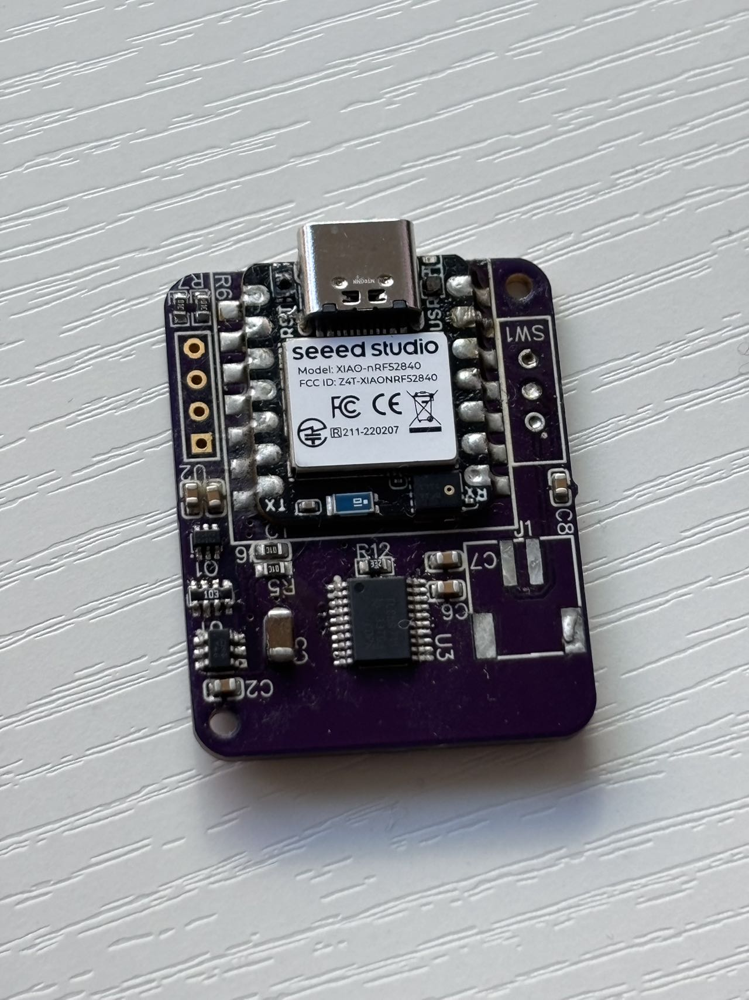
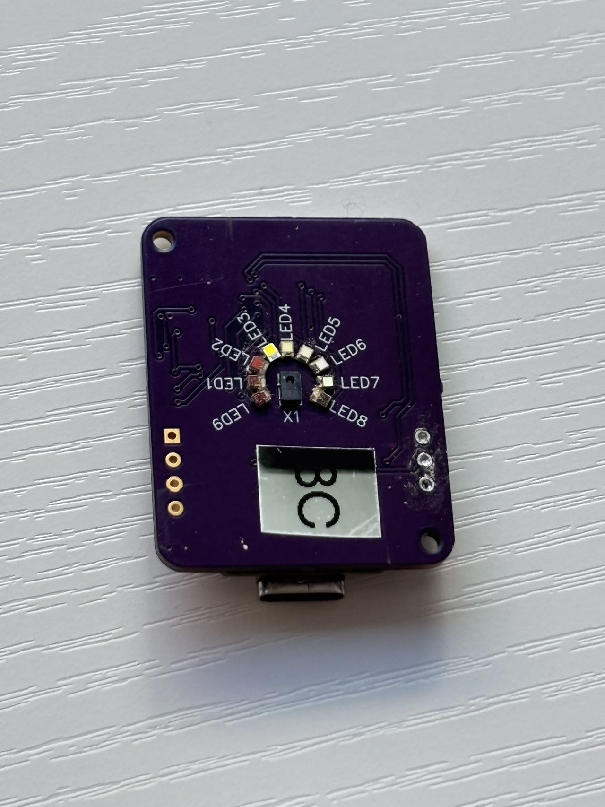
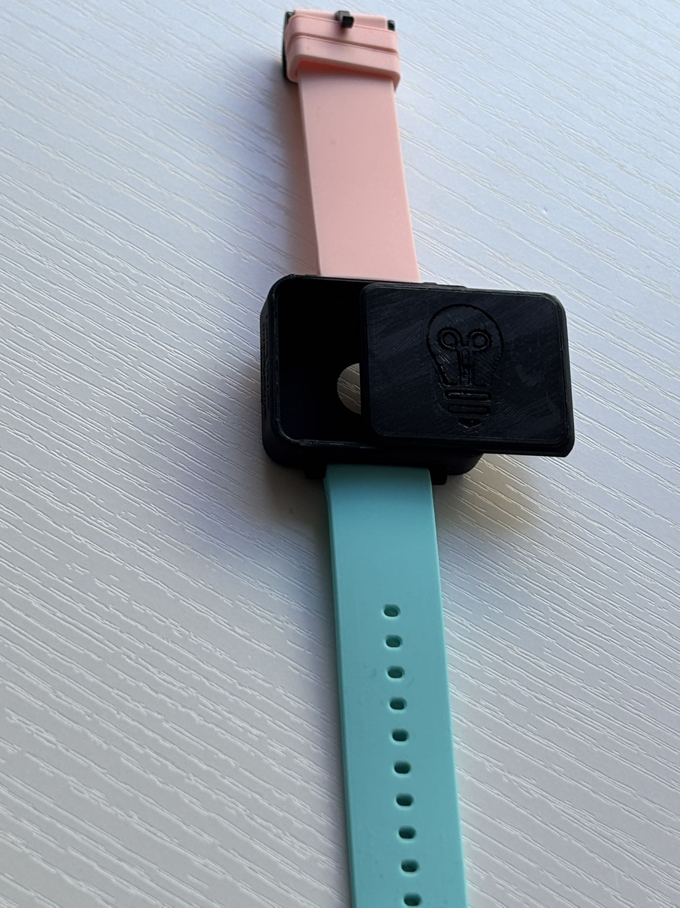
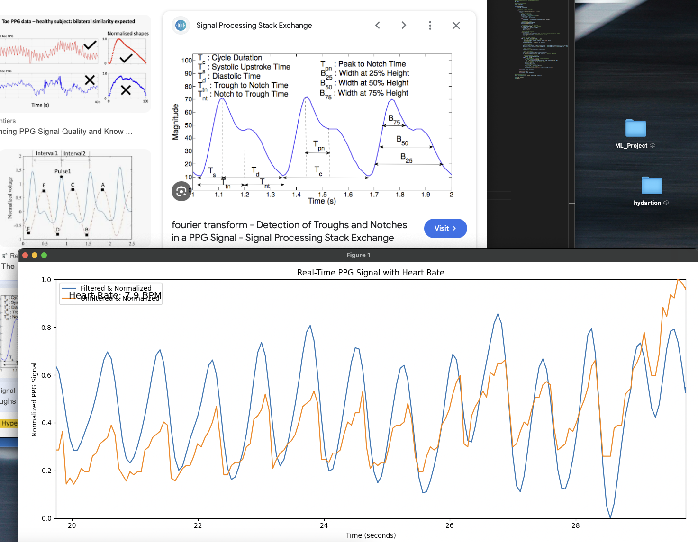

# AI_Hardware_Project_Group17_WearableML

## Team Name: 
6501_project_group_17

## Team Members:
- Haoran Zhang
- Xi Chen

## Project Title:
Sleep Detection with a Wearable Device 

## Project Description:
The goal of this project is to build a wearable device that incorporates TinyML to detect if someone is sleeping. 

## Current Progress: Completed

### Device Ready
We have completed the design and development of the device. Below is the current image of the device, including the PCB board and the watch with a 3D-printed case and customized watch band. 

**PCB Board:**

**PCB Board Back:**

**Watch with 3D-printed Case:**

### Signal Processing and Heart Rate Detection
We have implemented the Arduino and Python code to read the wavelength at 940nm. Using signal processing and a low-pass filter, we have successfully isolated the heart rate signal. This heart rate signal will serve as a crucial indicator of the sleep states.

### Data Visualization
To visualize the heart rate data, we have developed scripts that produce heart rate waveforms. Below is an image of the heart rate wave captured by our system:

## Key Objectives:
- Deliver the device that's comfortable to wear
- A communication system allowing wireless communication
- Embed TinyML to predict the states

## Technology Stack:
- Seeed XIAO nRF52840 sense
- Visual Studio Code, Python, C++
- Bambu 3D Printer

## Expected Outcomes:
A device, data communication system, and ML algorithm to detect if someone is sleeping. 

## Timeline:
This project will be completed in five weeks, with each week's deliverable being:
- Week 1: Device Design and mount on PCB board
- Week 2: Communication System
- Week 3: TinyML
- Week 4: Evaluation
- Week 5: Documents Write-up
